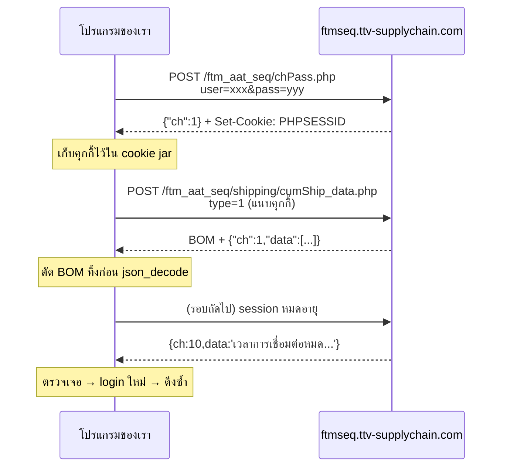

# คู่มือเชื่อมต่อ API ระบบ FTM SEQ (ftmseq.ttv-supplychain.com)

> เอกสารนี้เขียนเพื่อให้คน (หรือ AI ผู้ช่วยเขียนโค้ด) นำไปใช้ต่อได้ทันที
> เมื่อต้องดึงข้อมูลจากระบบ FTM SEQ ของฝ่าย IT เข้าสู่โปรเจ็คอื่น
> อ้างอิงจากการเชื่อมต่อจริงที่สำเร็จแล้วในเมนู **7.8 CUM Ship Inquiry**

---

## 1. ภาพรวมระบบปลายทาง

| หัวข้อ | รายละเอียด |
|---|---|
| Base URL | `https://ftmseq.ttv-supplychain.com/ftm_aat_seq/` |
| เทคโนโลยี | PHP + jQuery + **Webix UI** (Single Page App) |
| การยืนยันตัวตน | PHP Session ผ่านคุกกี้ `PHPSESSID` (ไม่มี OAuth / API key) |
| หน้า Login | `login.php` |
| Endpoint ตรวจรหัสผ่าน | `chPass.php` |
| รูปแบบ Endpoint ข้อมูล | `<โมดูล>/<ชื่อ>_data.php` |

**หลักสำคัญ:** ระบบนี้ไม่ได้ออกแบบมาเป็น Public API แต่เป็น backend ของหน้าเว็บ
ดังนั้นทุก endpoint ต้องมี session ที่ login แล้ว และต้องส่งพารามิเตอร์แบบเดียวกับที่หน้าเว็บส่ง

---

## 2. ขั้นตอนการเชื่อมต่อ (Flow ที่ถูกต้อง)



### 2.1 เข้าสู่ระบบ

```
POST https://ftmseq.ttv-supplychain.com/ftm_aat_seq/chPass.php
Content-Type: application/x-www-form-urlencoded

user=<USERNAME>&pass=<PASSWORD>
```

| ผลลัพธ์ | ความหมาย |
|---|---|
| `{"ch":1, ...}` | สำเร็จ — เซิร์ฟเวอร์ส่ง `Set-Cookie: PHPSESSID=...` มาด้วย |
| อย่างอื่น | ชื่อผู้ใช้หรือรหัสผ่านผิด (ข้อความอยู่ในคีย์ `data`) |

> ชื่อฟิลด์คือ `user` และ `pass` — **ไม่ใช่** `username`/`password`
> (ในหน้าเว็บ Webix ตั้ง `name` เป็น `login`/`email` แต่ตอน `$.post` แปลงเป็น `user`/`pass`)

### 2.2 ดึงข้อมูล

```
POST https://ftmseq.ttv-supplychain.com/ftm_aat_seq/shipping/cumShip_data.php
Cookie: PHPSESSID=<จากขั้นตอน 2.1>
Content-Type: application/x-www-form-urlencoded

type=1
```

---

## 3. รูปแบบคำตอบ (Response Envelope)

ทุก endpoint ตอบกลับด้วยซองมาตรฐาน `{"ch": <code>, "data": <payload>}`

| `ch` | ความหมาย | `data` | เป็น JSON ถูกต้องไหม |
|---|---|---|---|
| `1` | สำเร็จ | array ของ record | ✅ ใช่ (แต่มี BOM นำหน้า) |
| `2` | พารามิเตอร์ผิด | ข้อความ เช่น `"ข้อมูลไม่ถูกต้อง"`, `"TYPE ERROR"` | ✅ ใช่ |
| `10` | Session หมดอายุ / ยังไม่ login | `'เวลาการเชื่อมต่อหมด<br>คุณจำเป็นต้อง login ใหม่'` | ❌ **ไม่ใช่** |

> ⚠️ กรณี `ch:10` เซิร์ฟเวอร์ส่ง **JavaScript object literal** ไม่ใช่ JSON
> (`{ch:10,data:'...'}` — คีย์ไม่มีเครื่องหมายคำพูด ใช้ single quote)
> `json_decode()` จะคืน `null` ต้องตรวจด้วยการหาข้อความแทน

---

## 4. กับดักที่ต้องระวัง (สำคัญมาก)

### 4.1 UTF-8 BOM นำหน้า JSON
คำตอบที่สำเร็จขึ้นต้นด้วยไบต์ `EF BB BF` ทำให้ `json_decode()` คืน `null` พร้อม error `"Syntax error"`
ทั้งที่เนื้อหาดูถูกต้องทุกอย่าง

```php
$body = ltrim($body, "\xEF\xBB\xBF \t\n\r");
```

> อาการหลอก: ตรวจแล้ว UTF-8 ถูกต้อง วงเล็บปีกกาครบ ไม่มี control character แต่ decode ไม่ผ่าน
> ให้สงสัย BOM เป็นอย่างแรกเสมอ

### 4.2 Content-Type เป็น `text/html`
แม้จะส่ง JSON กลับมา header ก็ยังเป็น `text/html; charset=UTF-8`
**อย่าใช้ Content-Type ในการตัดสินว่าเป็น JSON หรือไม่**

### 4.3 ต้องเป็น POST เท่านั้น
เรียกด้วย GET หรือ POST ที่ไม่มี `type=1` จะได้ `ch:2` เสมอ
`type=2`, `type=3` ตอบ `"TYPE ERROR"` — endpoint นี้รับเฉพาะ `type=1`

### 4.4 HTTPS / ใบรับรอง
XAMPP บน Windows มักมี CA bundle เก่าเกินไป ทำให้เกิด
`SSL certificate problem: unable to get local issuer certificate`

**ห้ามแก้ด้วยการปิด `CURLOPT_SSL_VERIFYPEER`** ให้โหลด CA bundle ใหม่มาใช้แทน:
```
https://curl.se/ca/cacert.pem  →  เก็บไว้ที่ storage/certs/cacert.pem
```
```php
curl_setopt($ch, CURLOPT_CAINFO, '/path/to/cacert.pem');
```

### 4.5 อย่าดึงถี่เกินไป
ทีม IT ขอให้ดึงไม่เกิน **1 ครั้งต่อชั่วโมง** ต้องมีตัวกันรอบเสมอ
และ **ห้ามใช้เวลาจากฐานข้อมูล** เป็นตัวนับ เพราะบางโฮสติ้งตั้ง MySQL เป็น UTC
คนละเขตเวลากับ PHP → คำนวณผิด → ดึงซ้ำไม่หยุด ให้เก็บ timestamp ลงไฟล์ด้วยนาฬิกาของ PHP แทน

---

## 5. โค้ดตัวอย่างที่ใช้งานได้จริง (PHP + cURL)

```php
<?php
declare(strict_types=1);

final class FtmSeqClient
{
    private string $base = 'https://ftmseq.ttv-supplychain.com/ftm_aat_seq/';
    private string $cookieJar;

    public function __construct(
        private string $user,
        private string $pass,
        private string $caBundle,
        string $cookieJar = null
    ) {
        // เก็บนอก document root เสมอ และตั้งสิทธิ์ 0600
        $this->cookieJar = $cookieJar ?? sys_get_temp_dir() . '/ftmseq.cookies';
    }

    /** ดึงข้อมูล พร้อม login ใหม่อัตโนมัติเมื่อ session หมดอายุ */
    public function fetchData(string $path, array $fields = ['type' => 1]): array
    {
        $body = $this->request($this->base . $path, $fields);

        if ($this->isSessionExpired($body)) {
            $this->login();
            $body = $this->request($this->base . $path, $fields);
        }

        $json = json_decode($body, true);
        if (!is_array($json)) {
            throw new RuntimeException('คำตอบไม่ใช่ JSON: ' . mb_substr($body, 0, 200));
        }
        if (($json['ch'] ?? 0) !== 1) {
            throw new RuntimeException('API ผิดพลาด: ' . (is_string($json['data'] ?? null) ? $json['data'] : 'ไม่ทราบสาเหตุ'));
        }

        return $json['data'];
    }

    private function login(): void
    {
        $result = $this->request($this->base . 'chPass.php', [
            'user' => $this->user,
            'pass' => $this->pass,
        ]);

        // สำเร็จเมื่อมี ch:1 (รองรับทั้งแบบมีและไม่มีเครื่องหมายคำพูด)
        if (!preg_match('/["\']?ch["\']?\s*:\s*1\b/', $result)) {
            throw new RuntimeException('เข้าสู่ระบบไม่สำเร็จ: ชื่อผู้ใช้หรือรหัสผ่านไม่ถูกต้อง');
        }
    }

    private function request(string $url, array $fields): string
    {
        $ch = curl_init($url);
        curl_setopt_array($ch, [
            CURLOPT_RETURNTRANSFER => true,
            CURLOPT_POST           => true,
            CURLOPT_POSTFIELDS     => http_build_query($fields),
            CURLOPT_CONNECTTIMEOUT => 15,
            CURLOPT_TIMEOUT        => 90,
            CURLOPT_SSL_VERIFYPEER => true,   // ห้ามปิด
            CURLOPT_SSL_VERIFYHOST => 2,      // ห้ามปิด
            CURLOPT_CAINFO         => $this->caBundle,
            CURLOPT_COOKIEFILE     => $this->cookieJar,
            CURLOPT_COOKIEJAR      => $this->cookieJar,
            CURLOPT_USERAGENT      => 'MyIntegration/1.0',
        ]);

        $body  = curl_exec($ch);
        $code  = (int) curl_getinfo($ch, CURLINFO_RESPONSE_CODE);
        $error = curl_error($ch);
        curl_close($ch);

        if ($body === false || $error !== '') {
            throw new RuntimeException('เรียก API ไม่สำเร็จ: ' . $error);
        }
        if ($code !== 200) {
            throw new RuntimeException('HTTP ' . $code);
        }

        return ltrim((string) $body, "\xEF\xBB\xBF \t\n\r");   // ตัด BOM
    }

    private function isSessionExpired(string $body): bool
    {
        if (json_decode($body, true) !== null) {
            return false;
        }
        $head = mb_strtolower(mb_substr($body, 0, 500));

        return str_contains($head, 'เวลาการเชื่อมต่อหมด') || str_contains($head, 'login');
    }
}
```

**วิธีเรียกใช้:**
```php
$client = new FtmSeqClient(
    user: getenv('FTMSEQ_USER'),
    pass: getenv('FTMSEQ_PASS'),
    caBundle: __DIR__ . '/storage/certs/cacert.pem'
);

$rows = $client->fetchData('shipping/cumShip_data.php', ['type' => 1]);
echo count($rows);   // 1560
```

---

## 6. โครงสร้างข้อมูล 7.8 CUM Ship Inquiry

**Endpoint:** `shipping/cumShip_data.php` · **พารามิเตอร์:** `type=1`
**ขนาดจริง:** ~350 KB / ~1,560 record

```json
{
  "ch": 1,
  "data": [
    {
      "Cum_Year": "2026",
      "Part_Number": "AMS1WJ 26500B24 AE538P",
      "Part_Name": "N/A",
      "Supplier_Code": "CWEVB (ARK)",
      "Plant_Code": "GBL9A",
      "CUM_Ship_Qty": "0",
      "Last_Document": "N/A",
      "Last_Shipped": "03/08/26 07:21",
      "NO": 1
    }
  ]
}
```

| ฟิลด์ | ชนิด | หมายเหตุการแปลง |
|---|---|---|
| `Cum_Year` | string | ปี ค.ศ. → แปลงเป็น int |
| `Part_Number` | string | คั่นด้วย **ช่องว่าง** ปกติระบบอื่นใช้ `-` → ต้อง normalize |
| `Part_Name` | string | ค่า `"N/A"` = ไม่มีข้อมูล → แปลงเป็นค่าว่าง |
| `Supplier_Code` | string | รูปแบบ `"CWEVB (ARK)"` = `<GSDB> (<ชื่อย่อลูกค้า>)` |
| `Plant_Code` | string | เช่น `GBL9A` |
| `CUM_Ship_Qty` | string | เป็นตัวเลขในรูปสตริง อาจมีคอมมา → ต้อง parse |
| `Last_Document` | string | `"N/A"` = ไม่มีข้อมูล |
| `Last_Shipped` | string | **`dd/mm/yy HH:ii`** ปี ค.ศ. 2 หลัก → ระวังอย่าอ่านเป็น `mm/dd` |
| `NO` | int | ลำดับแถว 1..N |

**ข้อควรระวังตอนแปลงข้อมูล**
- `Part_Number` ควรทำ `part_key` (ตัดอักขระที่ไม่ใช่ตัวเลข/ตัวอักษรออก) ไว้ join กับตารางอื่น
- แถวที่ `Part_Number` เป็น `"N/A"` หรือว่าง ให้ข้าม
- `Supplier_Code` แยก GSDB code ด้วยการตัดคำแรกก่อนวงเล็บ

---

## 7. การจัดการรหัสผ่าน (ทำแบบนี้เท่านั้น)

### ❌ สิ่งที่ห้ามทำ
- ห้าม hardcode รหัสผ่านในไฟล์โค้ดหรือไฟล์ config ที่ commit ขึ้น git
- ห้ามเขียนรหัสผ่านไว้ในคอมเมนต์ (พลาดกันบ่อยมาก)
- ห้ามส่งรหัสผ่านให้ AI หรือพิมพ์ในแชท — ถือว่ารั่วทันทีและต้องเปลี่ยนรหัส
- ห้าม log ค่ารหัสผ่าน หรือ echo ออกหน้าจอตอน debug

### ✅ สิ่งที่ควรทำ

**วิธีที่ 1 — Environment variable (แนะนำที่สุด)**
```php
'user' => getenv('FTMSEQ_USER') ?: '',
'pass' => getenv('FTMSEQ_PASS') ?: '',
```

**วิธีที่ 2 — ไฟล์ config แยกที่ไม่ขึ้น git**

`.gitignore`
```gitignore
/config/config.local.php
/storage/*.cookies
/storage/*.state
```

`config/config.local.php` — เขียนให้แยกสภาพแวดล้อม เพื่อให้อัปโหลดขึ้นโฮสต์จริงได้โดยไม่ทับค่า production
```php
<?php
$isLocal = PHP_OS_FAMILY === 'Windows';   // เครื่องพัฒนาใช้ XAMPP

$config = [
    'ftmseq' => [
        'login' => ['fields' => ['user' => '...', 'pass' => '...']],
    ],
];

if ($isLocal) {
    $config['db'] = [/* ค่าเฉพาะเครื่อง */];
    $config['app']['debug'] = true;
}

return $config;
```

> 🔴 **บทเรียนจริง:** เคยอัปโหลด `config.local.php` ที่มีค่า DB ของ XAMPP (`root` / ไม่มีรหัส)
> ขึ้นโฮสต์จริง ทำให้เว็บล่มด้วย `Access denied for user 'root'@'127.0.0.1'`
> และ `debug=true` ยังทำให้ stack trace โผล่ให้คนนอกเห็นด้วย

**ข้อกำหนดอื่น**
- ไฟล์ config ต้องอยู่**นอก** document root (`public/`)
- ไฟล์ cookie jar ต้องอยู่นอก document root และตั้งสิทธิ์ `0600`
- ควรใช้บัญชี service account ของระบบ ไม่ใช่บัญชีส่วนตัวของพนักงาน
  (ถ้าเจ้าของบัญชีเปลี่ยนรหัสหรือลาออก ระบบจะพังทันที)
- ทางที่ดีที่สุดคือ **ขอ IT เปิด endpoint แบบไม่ต้อง login** หรือออก **API key** ให้ระบบโดยเฉพาะ

---

## 8. วิธีค้นหา Endpoint ใหม่ในระบบนี้

ถ้าต้องดึงเมนูอื่น (เช่น 7.9 Shipping Inquiry, 8.x อื่น ๆ) ใช้ขั้นตอนนี้

1. **หา URL ของหน้า** — เมนูซ้ายมี `id` กำกับ เช่น `{id:"cumShip", value:"7.8 CUM Ship Inquiry"}`
   หน้าเว็บมักอยู่ที่ `<โมดูล>/<id>.php`
2. **ดู endpoint ข้อมูล** — เกือบทุกหน้าเรียก `<id>_data.php` ในโฟลเดอร์เดียวกัน
3. **ดูพารามิเตอร์** — เปิด DevTools แท็บ Network แล้วกดใช้งานเมนูนั้น ดู payload ของ `$.post`
   รูปแบบที่พบทั้งระบบคือ `{ type: 1 }` สำหรับดึงทั้งหมด และ `{ obj: {...}, type: N }` สำหรับดึงรายการเดียว
4. **ทดสอบด้วย cookie jar** ที่ login แล้ว ไล่ค่า `type` จนกว่าจะได้ `ch:1`

> อย่าเดา URL แบบสุ่มยิงหลาย ๆ ครั้ง เพราะจะเป็นภาระกับเซิร์ฟเวอร์ของ IT
> ให้ดูจากซอร์สของหน้าเว็บเป็นหลัก

---

## 9. เช็คลิสต์ก่อนส่งงาน

- [ ] ไม่มีรหัสผ่านอยู่ในไฟล์ที่ commit ขึ้น git (รวมถึงในคอมเมนต์)
- [ ] `CURLOPT_SSL_VERIFYPEER` และ `CURLOPT_SSL_VERIFYHOST` เปิดอยู่
- [ ] ตัด UTF-8 BOM ก่อน `json_decode()`
- [ ] ตรวจ `ch` ก่อนใช้ `data` เสมอ
- [ ] มีตัวกันการดึงถี่ (≥ 1 ชั่วโมง) โดยใช้นาฬิกาของ PHP ไม่ใช่ของฐานข้อมูล
- [ ] มีการ login ใหม่อัตโนมัติเมื่อเจอ `ch:10`
- [ ] มี lock กันการดึงซ้อนกัน (`flock` แบบ `LOCK_EX | LOCK_NB`)
- [ ] cookie jar และไฟล์ config อยู่นอก document root
- [ ] ข้อความ error บอกสาเหตุชัดเจน (แยกกรณี "ยังไม่ login" ออกจาก "JSON เสีย")

---

## 10. ตัวอย่างการนำไปใช้จริงในโปรเจ็คนี้

| ไฟล์ | หน้าที่ |
|---|---|
| `app/Services/ApiSync.php` | คลาสฐาน — login, cookie jar, ตัด BOM, กันรอบ, lock, รายงานความคืบหน้า |
| `app/Services/AbtApi.php` | ผูกกับ 7.8 CUM Ship — กำหนดตารางปลายทางและการแปลงฟิลด์ |
| `app/Services/InventoryApi.php` | ผูกกับ 8.1 View Inventory (endpoint นี้ไม่ต้อง login) |
| `config/config.php` | URL, `post`, `login.url`, ระยะเวลาดึง (ไม่มีรหัสผ่าน) |
| `config/config.local.php` | รหัสผ่านจริง + ค่าเฉพาะเครื่อง (ไม่ขึ้น git) |
| `tools/sync_abt.php` | สคริปต์ CLI สำหรับ cron |

**ตั้ง cron ให้ดึงอัตโนมัติทุกชั่วโมง**
```cron
0 * * * * /usr/bin/php /path/to/project/tools/sync_abt.php
```

**ผลลัพธ์จริงที่ได้**
```
ดึงสำเร็จ 1560 แถว | 1560 รายการชิ้นส่วน | ยอดสะสมรวม 1,920,925 ชิ้น
```
